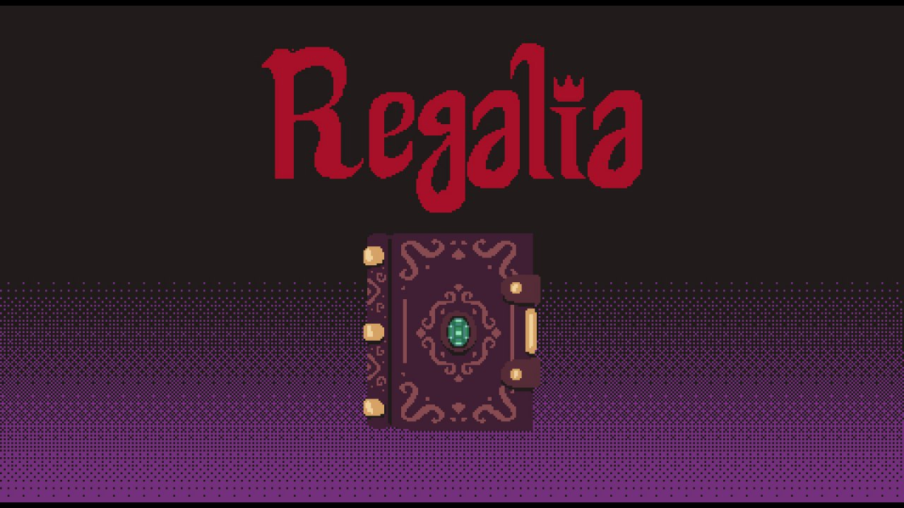
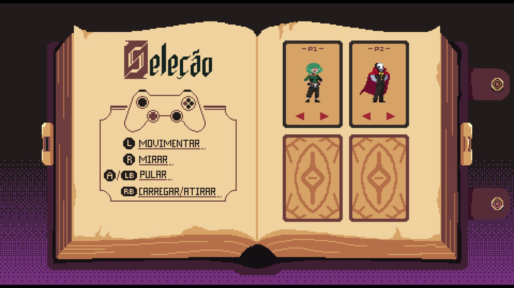
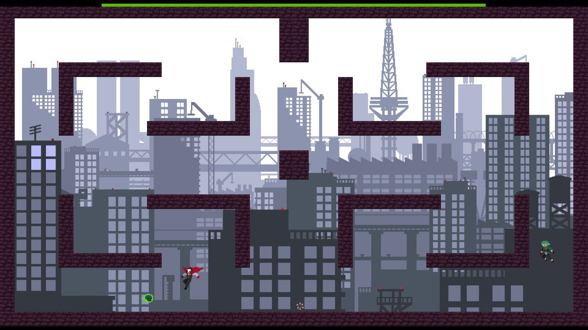

# Regalia

Um jogo de batalha em plataforma multiplayer local de até 4 jogadores. Vence o jogador que alcançar 3 vitórias. A temática é de mágia com dois personagens (Mister N e Gótica).




## História

Um poderoso mago, autor e detentor do livro supremo de magia morre. Por razões emocionais, o livro foi enterrado junto com ele, fato que infelizmente não passou despercebido por alguns magos. Se especula que o livro possui encantamentos tão poderosos que quem o possuísse se tornaria o novo mago mais poderoso. Logo, diversos magos do mundo começaram a se movimentar para conseguir tal poder. Uma nova era no mundo da magia começou.

Preocupado, um monge atlético, em busca do equilíbrio no mundo busca assegurar o controle do livro, para evitar que caia nas mãos do mal. Ao mesmo tempo, Sebastião, o alquimista, já velhinho e muito saudosista com o passado vê aí uma oportunidade de recuperar a sua juventude. Mr N, o maior ilusionista do mundo, atualmente em dificuldades financeiras acredita que o livro pode ajudá-lo a desenvolver o truque perfeito. Todos se movimentam até a Necrópole, lugar favorito na vida da Gótica, uma jovem com poderes das trevas. 

Para a infelicidade deles, todos acharam o túmulo do grande mago ao mesmo tempo, porém o grande mago havia colocado uma armadilha. Todos foram teleportados para dentro do livro e agora somente um deles sairá com vida.

## Observações

+ Cada partida dura 35 segundos. Se esse tempo for ultrapassado, balas se tornam indestrutíveis, refletindo nas paredes eternamente, para acelerar a morte dos jogadores
+ Existem 3 tipos de balas, o primeiro tipo não exige carregamento, o segundo exige 1s e o terceiro exige 2s
+ Balas caem de nível quando refletem na parede
+ Quanto maior o nível da bala, mais rápida ela é
+ Se carregar o tiro por mais de 3s, se perde o carregamento
+ Balas não se anulam
+ Não é possível se acertar

## Como Jogar

O modo preferível para se compilar o código é usando o Visual Studio. Nesse caso, basta abrir o arquivo `regalia.sln`, selecionar o alvo da compilação (Debug/Release, x64/x86) e executar o comando Build All (por padrão, atalho Ctrl + Shift + B) ou Run (Ctrl + F5), para executar o jogo imediatamente após a compilação. As dependências serão resolvidas automaticamente via Nuget.

Em sistemas Linux e Mac (ou Windows com MinGW), é necessário instalar as dependências manualmente.

Considerando que você já tem o SDL2 instalado e configurado, conecte no mínimo dois gamepads compatíveis com o protocolo Xinput (recomendados: Xbox 360, Xbox One ou PlayStation 4).

Para jogar basta executar o seguinte:

```bash
$ cd regalia
$ make run
```

Obs: por enquanto, os controles precisam ser conectados ao computador antes de o jogo ser executado para que eles sejam reconhecidos.

### Instruções de como jogar o jogo

Uma vez o jogo iniciado, se encontrará na tela inicial. Pressione A para ir para o menu. Use os botões direcionais para escolher as opções e aperte A para selecionar. Uma vez que selecionar para jogar, será redirecionado para a tela de seleção de personagem. Segue a baixo a página de seleção de personagens com as instruções de como jogar.



Cada jogador pode escolher sua persona por meio do analógico esquerdo e confirmar a seleção pressionando o botão A. Uma vez que todos os jogadores tenham confirmado a seleção, o jogo será iniciado.

#### Condições de vitória:

* Ganha um round, ou **capítulo**, o último jogador a permanecer vivo.
* O primeiro jogador a sair vitorioso de **três** capítulos vence a **partida**.
* Qualquer jogador morre ao receber um ataque, de **qualquer nível**, de um dos outros jogadores.


## Inspiração

Esse jogo foi fortemente inspirado em *TowerFall*, mas com uma pegada estratégica um pouco diferente utilizando tiros mágicos que podem refletir nas paredes.



## Membros

+ Claudio Segala Rodrigues Silva Filho - 150032552
  + Responsável principalmente pela colisão entre objetos, física e lógica dos estados.
+ Gustavo Henrique Fernandes Carvalho - 14/0021671
  + Responsável principalmente pelas animações, tile maps, transição entre estados de animação e mira.
+ Ricardo Arôso Mendes Kury - 14/0161082
  + Responsável principalmente pela física, movimentação dos personagens, efeitos sonoros e gerenciamento de input dos gamepads.
